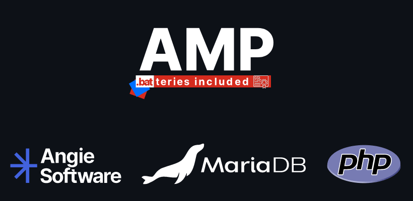
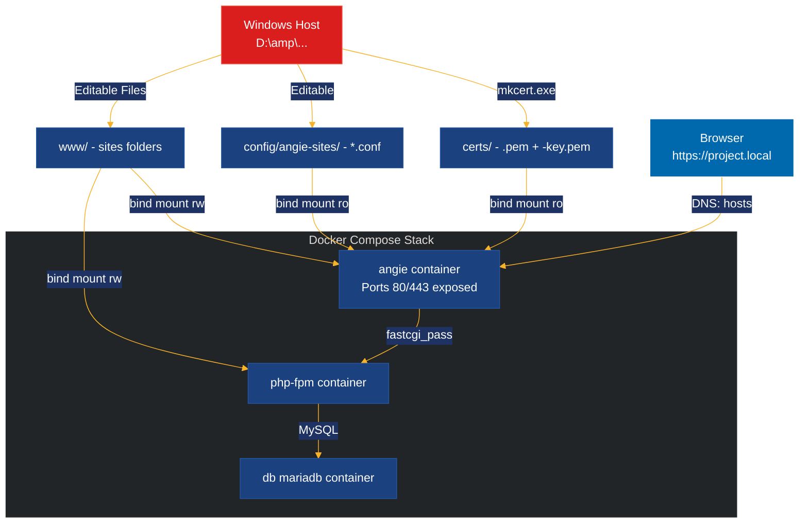

# AMP — Angie, MariaDB and PHP
**Docker-based Dev Stack with SSL for Windows**

**Lightweight Docker-based local dev environment** with Angie (NGINX fork), MariaDB, and PHP  
featuring **automatic HTTPS with green lock** for every `.local` domain.  

## Angie AMP Manager
**The System Architect’s Local Stack.**

---

   > [!TIP]
   > This stack is intentionally kept small and readable.  
   > You can open every .bat file, every .conf file, every docker-compose.yml.  
   > Change them. Break them. Fix them.  
   > That is how you really learn.

---

Fully portable to run from any drive (C:, D:, USB, network shares).

> ✅ **No hardcoded paths** — runs from wherever you unzip it  
> ✅ **Per-domain certificates** — each project gets its own trusted HTTPS cert  
> ✅ **Beginner-friendly** — one-click domain setup with green lock in browsers  
> ✅ **Production-like** — mirrors real-world LEMP stack architecture

---

## The Workflow



## The Architecture

### Directory Tree

```text
Windows Host (D:\amp\...)                                                                                
│                                                                                                    
├─ Host Folders (your code & configs — fully editable in VS Code / Notepad++)                       
│   ├── www/                     ← Web root (your sites: angie.local/, myproject.local/, ...)      
│   ├── config/                                                                                     
│   │   ├── AMP-MANAGER.bat      ← Generates CA, SSL, Configs, and scaffolding
│   │   ├── angie-sites/         ← Angie vhost configs (*.local.conf)                               
│   │   ├── certs/               ← SSL certs/keys (from mkcert)
│   │   ├── db-init/             # SQL bootstrap (root permissions/grants)
│   │   ├── dnsmasq/             # map any *.local to the Angie container                                 
│   │   └── php.ini              ← Custom PHP settings                                              
│   └── logs/                    ← PHP & app logs                                                  
│                                                                                                    
│   (You edit files here directly — no container copy/sync needed)                                 
│                                                                                                    
├─ Docker Desktop (runs Linux VM underneath)                                                        
│   │                                                                                                
│   └─ Docker Compose (amp stack)                                                                   
│       ├── Network (amp-network) ───────────────┐                                                  
│       │                                        │                                                  
│       ├── Volumes / Bind Mounts (host ↔ container mapping)                                       
│       │   ├── D:\amp\www                →  /www (rw)             # Sites served from host           
│       │   ├── D:\amp\config\angie-sites → /etc/angie/http.d (ro) # Angie reads your vhosts      
│       │   ├── D:\amp\config\certs       → /etc/angie/certs (ro)  # SSL certs visible inside Angie    
│       │   └── D:\amp\logs               → /var/log/php (rw)      # (optional) Logs written back to host         
│       │                                                                                           
│       ├── Services (containers)                                                                   
│       │   ├── angie (docker.angie.software/angie:latest)                                          
│       │   │   ├─ Ports: 80:80, 443:443    Browser → localhost → Angie                             
│       │   │   └─ Reads configs from /etc/angie/http.d/*.local.conf                               
│       │   │                                                                                       
│       │   ├── php (webdevops/php:8.3/8.4)                                                             
│       │   │   ├─ FPM listens on 9000/tcp (internal)                                               
│       │   │   └─ Reads code from /www (your host files — live reload)                            
│       │   │                                                                                       
│       │   └── db (mariadb:10.11)                                                                  
│       │       └─ Data persisted (named volume or bind mount)                                      
│       │                                                                                           
│       └── Workflow arrows (simplified)                                                            
│                                                                                                    
└─ Browser (https://angie.local / myproject.local)                                                  
    ↓ (DNS: hosts file or wildcard → 127.0.0.1)                                             
    → Windows host ports 80/443 → Docker published ports → Angie container
```

## 🔧 Features

- **Angie** (modern NGINX fork) with HTTP/3 support
- **MariaDB** 11.x (MySQL-compatible)
- **PHP 8.3** (with common extensions: mysqli, pdo_mysql, gd, zip, etc.)
- **Automatic HTTPS** via mkcert, green lock for all `.local` domains
- **Per-project isolation**, each domain has its own certificate + config
- **[ ] Todo Fully portable App**, no installation required that works from any location

---

## 🚀 Quick Start

### 1. Prerequisites
- Windows 10/11 (64-bit)
- [Docker Desktop](https://www.docker.com/products/docker-desktop/) (with WSL2 backend recommended)
- Administrator privileges (for initial CA installation)

### 2. Setup

Option A: Git clone

```cmd
git clone https://github.com/gigamaster/amp.git
```

Option B: Download ZIP → Extract to ANY location (C:\amp, D:\dev, USB drive, etc.)

### 3. First Run (One-Time Setup)

1. Navigate to `config` folder
2. **Right-click `AMP-MANAGER.bat` → UAC/elevation to run as administrator**
3. Click **"Yes"** when Windows Security dialog appears, mkcert install your Certificate Authority (CA)
4. Follow prompts to create your first domain (e.g., `angie` → becomes `https://angie.local`)

> [!TIP]
> Keep `ANP-MANAGER.bat` handy on your desktop  
> Run as admin whenever you start a new project.  
> Takes 10 seconds to get a green-lock HTTPS site ready for development.

### 4. Start the Stack
From amp folder (where docker-compose.yml lives):

```cmd
docker compose up -d
```

### 5. Test Your Site
1. Create `www/angie.local/index.php`:
   ```php
   <?php phpinfo();
   ```
2. Visit `https://angie.local` → ✅ **Green lock!**

---

## 📂 Project Structure - Workflow

```
amp/
├── config/
│   └── AMP-MANAGER.bat  ← First run as Admin to manage domains/certs
├── www/
│   └── project.local/   ← Your project files (index.php/html here)
├── docker-compose.yml   ← Stack definition (Angie + MariaDB + PHP)
└── README.md
```

---

## ⚙️ Daily Usage

| Command | Description |
|---------|-------------|
| `docker compose up -d` | Start stack (run from project root) |
| `docker compose down` | Stop stack |
| `docker compose logs -f angie` | Live Angie logs |
| `docker compose logs -f php` | Live PHP logs |
| `docker compose restart angie` | Reload configs after domain changes |

---

## 🔒 Domain Management (`ssl.bat`)

Run `config/AMP-MANAGER.bat` **Windows prompt as Administrator** to:

1. **Add domain**: Enter `project` → creates:
   - Certificate: `config/certs/project.local.pem`
   - Hosts entry: `127.0.0.1 project.local`
   - Web root: `www/project.local/`
   - Angie config: `config/angie-sites/project.local.conf`
   - Auto-restart Angie + open browser (optional)

2. **Remove domain**: Comments out hosts entry + optional cert cleanup  
   *(Backup saved as `hosts.bak`)*

> ✅ **No manual config needed** — everything automated per workflow

---

## 💡 PHP Version Tip

PHP 8.3 official security support ended December 31, 2025. To switch versions:

1. Edit `docker-compose.yml`:
   ```yaml
   services:
     php:
       # Change image tag:
       image: webdevops/php-nginx:8.2  # ← 8.1, 8.2, 8.3, 8.4 available
   ```
2. Rebuild containers:
   ```cmd
   docker compose down
   docker compose build --no-cache
   docker compose up -d
   ```

> [!NOTE]
> All versions include same extensions (mysqli, pdo_mysql, gd, zip, etc.)

---

## 🛠️ Troubleshooting

### 🔸 Ports 80/443 already in use?

```cmd
# Check what's using ports:
netstat -ano | findstr ":80"
netstat -ano | findstr ":443"

# Common culprits:
# - Skype → Settings → Advanced → uncheck "Use port 80/443"
# - IIS → Windows Features → uncheck "Internet Information Services"
# - Other dev tools (XAMPP, WSL2 nginx) → stop their services first
```

### 🔸 Can't edit hosts file?

From **PowerShell (Admin)**:

```powershell
notepad $env:windir\System32\drivers\etc\hosts
```

From **normal PowerShell** (opens Notepad as Admin):

```powershell
Start-Process notepad.exe -Verb runas -ArgumentList "$env:windir\System32\drivers\etc\hosts"
```

### 🔸 Verify mkcert CA installed?

1. Press `Win+R` → type `certmgr.msc` → Enter
2. Navigate to: **Trusted Root Certification Authorities → Certificates**
3. Look for issuer: `mkcert <your-machine-name>\<your-username>`

### 🔸 Certificate not trusted in Firefox?

Firefox uses its own certificate store:
1. Find root CA: Run `mkcert -CAROOT` in `config` folder
2. In Firefox: `about:preferences#privacy` → Certificates → View Certificates → Authorities → Import → `rootCA.pem`

### 🔸 Docker commands failing?

- Ensure Docker Desktop is running (system tray icon visible)
- Restart Docker Desktop if containers won't start
- Check WSL2 integration: Docker Desktop → Settings → Resources → WSL Integration

---

## 🌐 Why `.local` Domains?

- Officially reserved for local network use ([RFC 6762](https://datatracker.ietf.org/doc/rfc6762/))
- Never resolves on public internet → safe for development
- Works with mDNS/Bonjour on macOS/Linux (though Windows uses hosts file)

---

## 🚧 TODO
Desktop portable app

**Portability**: Entire stack works from **any path** — `C:\amp`, `D:\projects\angie-amp`, `\USB\amp`, etc. No configuration needed.

---

## 📜 License

- **ANGIE-AMP**: MIT License
- **Angie**: [BSD 2-Clause](https://angie.software/)
- **mkcert**: [BSD 3-Clause](https://github.com/FiloSottile/mkcert)
- Docker images: [webdevops/php-nginx](https://github.com/webdevops/Dockerfile)

---


[](https://github.com/gigamaster/angie-amp)  

*Made with ❤️ for simplicity and reliability*
