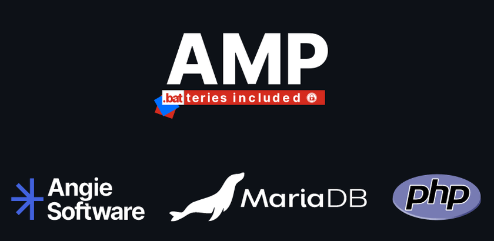
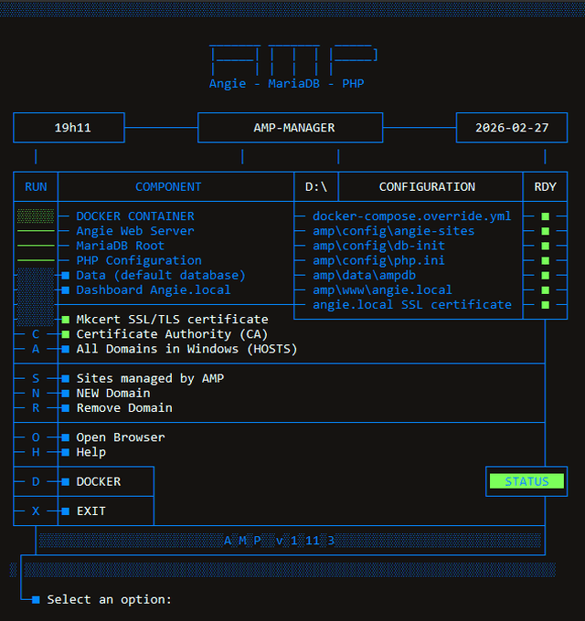
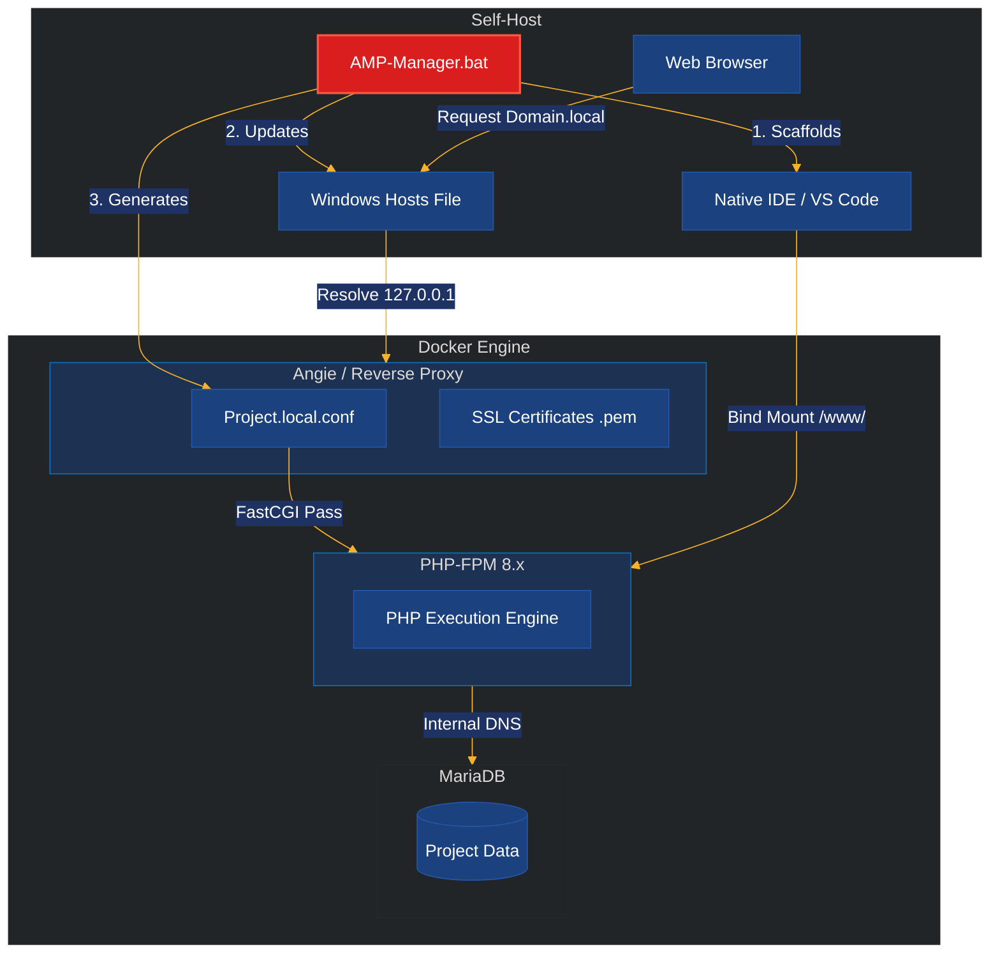
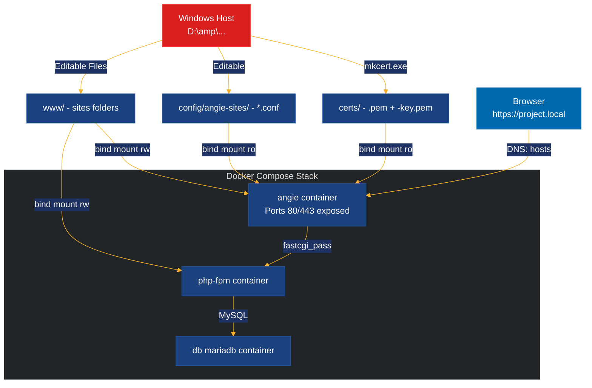

<p align="center">
  <picture>
    
  </picture>
</p>
<p align="center">
  <picture>
    
  </picture>
</p>
<p align="center">
  
</p>

<h3 align="center">AMP Manager — Angie, MariaDB and PHP</h3>
<p align="center"><b>Docker-based Dev Stack with Trusted SSL for Windows</b></p>
<picture align="center">

</picture>


<div style="text-align:center;">
  <p align="center">From Code Consumers to Stack Architects<br> 
  One <code>.local</code> at a Time.</p>
  <p align="center">Because Knowing <b>How</b> the Stack Works<br>
  Beats Just Making It Work!
  </p>
  <picture align="center">
  
  </picture>
</div>


```cmd
📢 Overcome the architectural enclosure, it's just another form of control.
REM
> This stack is intentionally kept small and readable.  
> You can open every .bat file, every .conf file, every docker-compose.yml.  
> Change them > Break them > Fix them.  
> That is how you really learn.
```

## Features

| Stack    | Description        |
|----------|--------------------|
| **AMP-Manager**| Open utility to scaffold .local domains, and generate certificate + config |
| **Angie** | Modern NGINX fork with HTTP/3 support, modules, and API stats |
| **MariaDB** |  version 10.++, MySQL-compatible |
| **PHP** |  version 8.3.++, common extensions: mysqli, pdo_mysql, gd, zip, etc. |
| **CA / SSL** |  **HTTPS** using **mkcert** for easy install a CA, and green lock all `.local` domains |


## Quick Start

**Your Local Dev Environment**

Follow these steps in order to build your first project.

### Prerequisites
- Windows 10/11 (64-bit)
- [Docker Desktop](https://www.docker.com/products/docker-desktop/) (with WSL2 backend recommended)
- Administrator privileges (for initial CA installation)

### 1. Preparation

* **Download:**   
  Clone the repository or download a release ZIP and extract it to a folder e.g. `D:\amp\`

```cmd
git clone https://github.com/gigamaster/amp.git
```

* **Launch Docker:**   
  Open Docker Desktop and ensure the engine is running.
   
* **Boot the Stack:**   
  From amp folder (where docker-compose.yml lives), open a terminal and run:

```bash
docker compose up -d
```

### 2. First Run (One-Time Setup)

1. Navigate to `config` folder
2. **Right-click `AMP-MANAGER.bat` → UAC/elevation to run as administrator**
3. Click **"Yes"** when Windows Security dialog appears, mkcert install your Certificate Authority (CA)
4. Follow prompts to create your first domain e.g. `angie` → becomes `https://angie.local`


> [!TIP]
> Keep `ANP-MANAGER.bat` handy on your desktop, run `Create-shortcut.bat`  


AMP-MANAGER.bat runs as admin whenever you start a new project.  
Takes 10 seconds to get a green-lock HTTPS site ready for development.


### 3. The AMP-MANAGER Setup

Run **`AMP-MANAGER.bat`** as Administrator. This tool is the "Architect" of your environment.

* On the first run, it installs your **Certificate Authority**.  
  This allows your browser to trust your local `.local` sites with green SSL locks.
* **Add Your First Site:** Select **[N] New Domain** and type `angie`.
* Note that AMP-MANAGER automatically adds `.local`  
  - optionally scaffolds new domain folder
  - generates the domain SSL `.pem` files
  - creates the server configuration.*

* **Reload Angie:** For the server to see your new site configuration, restart the container:  

from AMP-MANAGER, or terminal:

```bash
docker restart angie
```

### 4. Test Your Site

On AMP-MANAGER, Select **[O] Open Browser** and visit the default **angie.local**
or open your browser and go to **`https://angie.local`**, check ✅ **Green lock!**

The default domain is your **Control Center** for documentation, health checks, and status monitoring.


<p align="center">
  <br>
  <a href="https://gigamaster.github.io/amp/">anglie.local → preview [docs]</a>
  <br><br><br>
</p>


## 📂 Project Structure - Workflow

```
amp/
├── config/
│   └── AMP-MANAGER.bat  ← First run as Admin to manage domains/certs
├── www/
│   └── project.local/   ← Your project files (index.php/html here)
├── docker-compose.yml   ← Stack definition (Angie + MariaDB + PHP)
└── README.md
```

---

## ⚙️ Daily Usage

| Command | Description |
|---------|-------------|
| `docker compose up -d` | Start stack (run from project root) |
| `docker compose down` | Stop stack |
| `docker compose logs -f angie` | Live Angie logs |
| `docker compose logs -f php` | Live PHP logs |
| `docker compose restart angie` | Reload configs after domain changes |

---

## 🔒 Domain Management - AMP-MANAGER.bat

Run `config/AMP-MANAGER.bat` **Windows prompt as Administrator** to:

1. **Add domain**: Enter `project` → creates:
   - Certificate: `config/certs/project.local.pem`
   - Hosts entry: `127.0.0.1 project.local`
   - Web root: `www/project.local/`
   - Angie config: `config/angie-sites/project.local.conf`
   - Auto-restart Angie + open browser (optional)

2. **Remove domain**: Comments out hosts entry + optional cert cleanup  
   *(Backup saved as `hosts.bak`)*

> ✅ **No manual config needed** — everything automated per workflow

---


## Overall Workflow

### How AMP-Manager enables local development
This diagram shows the high-level workflow a student follows when using AMP-Manager:

- Launch amp-manager.bat
- Tool checks the environment (required files, updates hosts file, starts containers, generates trusted local SSL certificate via mkcert)
- Developer opens browser, requests project.local
- OS hosts file redirects .local domain to Docker network (Angie proxy → PHP + MariaDB)

It illustrates the end-to-end user journey from starting the tool to reaching a working HTTPS site in the browser.



```mermaid
---
config:
  theme: 'base'
  themeVariables:
    primaryColor: '#1b417e'
    primaryTextColor: '#fff'
    primaryBorderColor: '#2457a8'
    lineColor: '#F8B229'
    secondaryColor: '#1e3363'
    secondaryBorderColor: '#ff9800'
    tertiaryColor: '#212527'
    tertiaryBorderColor: '#272727'
---
graph TD
    subgraph Windows_Host [Self-Host]
        Browser[Web Browser]
        HostsFile[Windows Hosts File]
        IDE[Native IDE / VS Code]
        Manager[AMP-Manager.bat]
    end

    subgraph Docker_Engine [Docker Engine]
        subgraph Angie_Container [Angie / Reverse Proxy]
            Vhost[Project.local.conf]
            SSL[SSL Certificates .pem]
        end
        subgraph PHP_Container [PHP-FPM 8.x]
            Code[PHP Execution Engine]
        end
        subgraph DB_Container [MariaDB]
            Data[(Project Data)]
        end
    end

    %% Interactions
    Manager --"1. Scaffolds"--> IDE
    Manager --"2. Updates"--> HostsFile
    Manager --"3. Generates"--> Vhost
    
    Browser --"Request Domain.local"--> HostsFile
    HostsFile --"Resolve 127.0.0.1"--> Angie_Container
    
    Vhost --"FastCGI Pass"--> PHP_Container
    IDE --"Bind Mount /www/"--> PHP_Container
    PHP_Container --"Internal DNS"--> DB_Container
    
    %% Styling
    style Manager fill:#da1e1e,stroke:#ff5742,stroke-width:2px
    style Angie_Container fill:#1b417e80,stroke:#0a6fc2
    style PHP_Container fill:#1b417e80,stroke:#0a6fc2
```

Fully portable to run from any drive (C:, D:, USB, network shares).

> ✅ **No hardcoded paths** — runs from wherever you unzip it  
> ✅ **Per-domain certificates** — each project gets its own trusted HTTPS cert  
> ✅ **Beginner-friendly** — one-click domain setup with green lock in browsers  
> ✅ **Production-like** — mirrors real-world LEMP stack architecture

> A bind mount is a Linux mechanism that mounts an existing file or directory tree from the host system into a new location, often used to map local host directories into Docker containers for direct, high-> performance file sharing and synchronization. It provides real-time, two-way updates between the host and the target, commonly used for development or sharing configuration files.

---

## The Infrastructure Process Flow

**Host and container relationship, bind mounts, local domain and certificate creation.**

This diagram focuses on the technical process flow and file-system bridging that AMP-Manager sets up behind the scenes:

- Host → bind mounts (editable project files + config visible on both sides)
- Hosts file modification (myproject.local → container IP)
- mkcert certificate generation + trust (.pem files mounted into Angie)
- Angie (reverse proxy) handles HTTPS termination for all .local domains

It emphasizes how the local domain becomes trusted and resolvable, and how source code/config remains editable directly on the host machine.


```mermaid
---
config:
  theme: 'base'
  themeVariables:
    primaryColor: '#1b417e'
    primaryTextColor: '#fff'
    primaryBorderColor: '#2457a8'
    lineColor: '#F8B229'
    secondaryColor: '#1e3363'
    secondaryBorderColor: '#ff9800'
    tertiaryColor: '#212527'
    tertiaryBorderColor: '#272727'
---
graph TD
    A[Windows Host<br><font color=white>D:\amp\...</font>] -->|Editable Files| B[www/ - sites folders]
    A -->|Editable| C[config/angie-sites/ - *.conf]
    A -->|mkcert.exe| D[certs/ - .pem + -key.pem]

    subgraph Docker Compose Stack
        E[angie container<br>Ports 80/443 exposed]
        F[php-fpm container]
        G[db mariadb container]
    end

    B -->|bind mount rw| E
    B -->|bind mount rw| F
    C -->|bind mount ro| E
    D -->|bind mount ro| E

    Browser[Browser<br>https://project.local] -->|DNS: hosts| E
    E -->|fastcgi_pass| F
    F -->|MySQL| G

    style A fill:#da1e1e,stroke:#ff5742
    style Browser fill:#0069ae,stroke:#fff
    
```

## The Directory Tree

Train the Architect Mindset – One Trusted .local Domain at a Time

```text
Windows Host (D:\amp\...)
│                        
├─ Host Folders (code & configs — fully editable in IDE/Notepad)
│   ├── www/                     ← Web root (your sites: angie.local/, project.local/, ...)
│   ├── config/
│   │   ├── AMP-MANAGER.bat      ← Generates CA, SSL, Configs, and scaffolding
│   │   ├── angie-sites/         ← Angie vhost configs (*.local.conf) 
│   │   ├── certs/               ← SSL certs/keys (from mkcert)
│   │   ├── db-init/             # SQL bootstrap (root permissions/grants)
│   │   ├── mkcert.exe           # Mkcert command-line utility (CA and SSL)
│   │   ├── angie.conf           # Angie Server configuration (modules)
│   │   └── php.ini              ← PHP configuration, custom settings
│   ├── data/                    ← Database 
│   └── logs/                    ← Angie, DB, PHP & app logs
│
│   (You edit files here directly — no container copy/sync needed)
│                                   
├─ Docker Desktop (runs Linux VM underneath)
│   │                                                         
│   └─ Docker Compose (amp stack)
│       ├── Network (amp-network) ───────────────┐
│       │                                        │
│       ├── Volumes / Bind Mounts (host ↔ container mapping)
│       │   ├── D:\amp\www                →  /www (rw)             # Sites served from host
│       │   ├── D:\amp\config\angie-sites → /etc/angie/http.d (ro) # Angie reads your vhosts
│       │   ├── D:\amp\config\certs       → /etc/angie/certs (ro)  # SSL certs for Angie
│       │   └── D:\amp\logs               → /var/log/php (rw)      # (optional) Logs to host
│       │
│       ├── Services (containers)
│       │   ├── angie (docker.angie.software/angie:latest)
│       │   │   ├─ Ports: 80:80, 443:443    Browser → localhost → Angie
│       │   │   └─ Reads configs from /etc/angie/http.d/*.local.conf
│       │   │                                
│       │   ├── php (webdevops/php:8.3/8.4)
│       │   │   ├─ FPM listens on 9000/tcp (internal)
│       │   │   └─ Reads code from /www (your host files — live reload)
│       │   │                             
│       │   └── db (mariadb:10.11)
│       │       └─ Data persisted (bind mount D:\amp\data\)
│       │
│       └── Workflow arrows (simplified)
│
└─ Browser (https://angie.local / project.local)
    ↓ (DNS: hosts file or wildcard → 127.0.0.1)
    → Windows host ports 80/443 → Docker published ports → Angie container
```

## 💡 PHP Version Tip

PHP 8.3 official security support ended December 31, 2025. To switch versions:

1. Edit `docker-compose.yml`:
   ```yaml
   services:
     php:
       # Change image tag:
       image: webdevops/php-nginx:8.2  # ← 8.1, 8.2, 8.3, 8.4 available
   ```
2. Rebuild containers:
   ```cmd
   docker compose down
   docker compose build --no-cache
   docker compose up -d
   ```

> [!NOTE]
> All versions include same extensions (mysqli, pdo_mysql, gd, zip, etc.)

---

## 🛠️ Troubleshooting

### 🔸 Ports 80/443 already in use?

```cmd
# Check what's using ports:
netstat -ano | findstr ":80"
netstat -ano | findstr ":443"

# Common culprits:
# - Skype → Settings → Advanced → uncheck "Use port 80/443"
# - IIS → Windows Features → uncheck "Internet Information Services"
# - Other dev tools (XAMPP, WSL2 nginx) → stop their services first
```

### 🔸 Can't edit hosts file?

From **PowerShell (Admin)**:

```powershell
notepad $env:windir\System32\drivers\etc\hosts
```

From **normal PowerShell** (opens Notepad as Admin):

```powershell
Start-Process notepad.exe -Verb runas -ArgumentList "$env:windir\System32\drivers\etc\hosts"
```

### 🔸 Verify mkcert CA installed?

1. Press `Win+R` → type `certmgr.msc` → Enter
2. Navigate to: **Trusted Root Certification Authorities → Certificates**
3. Look for issuer: `mkcert <your-machine-name>\<your-username>`

### 🔸 Certificate not trusted in Firefox?

Firefox uses its own certificate store:
1. Find root CA: Run `mkcert -CAROOT` in `config` folder
2. In Firefox: `about:preferences#privacy` → Certificates → View Certificates → Authorities → Import → `rootCA.pem`

### 🔸 Docker commands failing?

- Ensure Docker Desktop is running (system tray icon visible)
- Restart Docker Desktop if containers won't start
- Check WSL2 integration: Docker Desktop → Settings → Resources → WSL Integration

---

## 🌐 Why `.local` Domains?

- Officially reserved for local network use ([RFC 6762](https://datatracker.ietf.org/doc/rfc6762/))
- Never resolves on public internet → safe for development
- Works with mDNS/Bonjour on macOS/Linux (though Windows uses hosts file)

---

## 🚧 TODO
Desktop portable app

**Portability**: Entire stack works from **any path** — `C:\amp`, `D:\projects\angie-amp`, `\USB\amp`, etc. No configuration needed.

---

## 📜 License

- **ANGIE-AMP**: MIT License
- **Angie**: [BSD 2-Clause](https://angie.software/)
- **mkcert**: [BSD 3-Clause](https://github.com/FiloSottile/mkcert)
- Docker images: [webdevops/php-nginx](https://github.com/webdevops/Dockerfile)

---


<p align="center">
<br>  
  <a href="https://github.com/gigamaster/amp">
  
<br>
<i>
Made with ❤️ for simplicity and reliability
</i>
</p>
